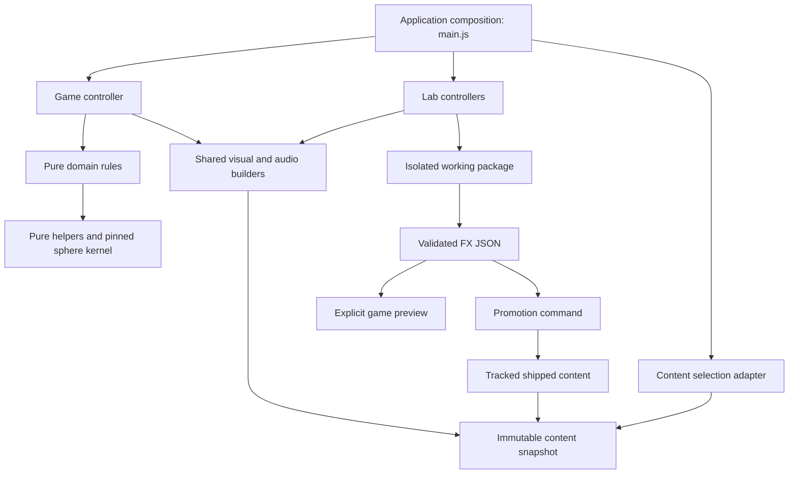

# Stalheart technical foundation

The owner's sequence is **architecture → visual/sound labs and clean exports → UX → playability**. Preserve the playable baseline while building the technical foundation. The first implementation establishes content ownership, pure rules and an executable authoring handoff; it does not claim that the inherited game controller has already been replaced.

## Ownership and dependencies



| Owner | Current files | Contract |
| --- | --- | --- |
| Core | `src/core/knobs.js`; pinned kernel in `src/` | No browser, persistence, rendering or game-controller dependencies |
| Domain | `src/domain/{economy,campaign,shield,berths,audiomix,audiogate}.js` | Rules over explicit values/state; no renderer, UI or storage; original top-level paths are compatibility re-exports |
| Content | `src/content/` | Defaults, portable schema, validation and one immutable snapshot per application lifetime; no Three.js or browser dependencies |
| Platform | `src/platform/` | Browser draft persistence and startup selection; errors are surfaced before the game starts |
| Presentation | Existing `impactfx.js`, `shotfx.js`, `beamdraw.js`, `audio.js`, model adapters | Shared builders consumed by game and labs; local geometry and explicit transforms; renderer/device ownership stays outside pure rules |
| Labs | `src/labs/`, existing `*-tab.js` lab controllers | Work on independent copies. Export validated data. Never import the game controller |
| Composition | `main.js`, inherited `td-tab.js` | Select content before consumers load. The TD closure still owns substantial simulation, rendering, input and tutorial integration |

`npm run architecture` enforces dependency rules and cycles in the migrated pure layers and rejects game/lab controller coupling. `npm run architecture -- --report` writes the dependency graph to `artifacts/architecture.json`. These are static import/browser-dependency checks, not a replacement for runtime tests. Legacy files outside the named layers remain an explicit migration boundary.

Compatibility facades preserve existing imports and tests while each moved implementation has one owner. Avoid copying an implementation into both paths. New pure code should import the owned module directly.

## Authoring contract

A schema-1 FX package has `application`, `base`, `id`, `weapons` and `audio`. It includes every existing weapon profile and sound cue, so moving between the visual and sound labs retains the other half of the package. It contains no camera settings, saved progress, user volume preferences, external URLs or executable snippets.

- Visual fields: tracer appearance, muzzle/impact recipe, scale, color and bounded effect knobs.
- Audio fields: cue gain, voice cap, retrigger interval and pitch variation. Sample paths and bus assignments remain pinned runtime references.
- Weapon kinds, flight speeds and plasma behavior are locked to the schema's baseline because the game uses them as rules. New mechanics require a deliberate contract revision, not an artistic preset change.
- Unknown/missing fields, incompatible schema/base, non-finite or out-of-range values and invalid recipes are rejected before mutation.
- Selection clones and freezes the entire package. A draft cannot mutate the selected game's content. A second selection in the same lifetime is refused.
- A preset ID is a human label, not a content hash. Release build fingerprints identify shipped bytes; retain the exported JSON when comparing drafts with reused names.

The base is `stalheart-fx-1`. Schema changes require an explicit migration or a new base. Never silently coerce an incompatible artifact into a different-looking result.

## Actual workflow

1. Open the [impact lab](../labs.html#impact) or [sound lab](../labs.html#audio). Each starts from the shipped package, or the explicitly selected preview package.
2. Edit an isolated working copy. Use **Export JSON** to retain the complete package. **Import JSON** validates before replacing the current working copy.
3. **Save draft** stores a local working artifact; **Load draft** carries it into the other lab. Storage failure is reported. Normal game startup ignores drafts.
4. **Preview in game** saves the draft and opens `index.html?preset=draft`. Missing/invalid explicit previews stop with a visible error, rather than silently showing a different package.
5. Promote an exported file with `npm run presets -- promote FILE`. This writes only `src/content/shipped.js`, atomically, as a deterministic data module. Review its Git diff, then run tests/check/build. No deployment occurs.

```sh
npm run presets -- export /tmp/current.stalheart-fx.json
npm run presets -- check /tmp/candidate.stalheart-fx.json
npm run presets -- promote /tmp/candidate.stalheart-fx.json
npm test
npm run check
npm run build
```

The same generated module is consumed in Node validation and the browser release. Existing source-copy buttons in the impact lab are labeled legacy; JSON is the supported package workflow. Beam, material, portal, cinematic and unit-specific exporters have not yet been converted to this schema. Do not describe them as covered until their actual runtime inputs are represented and tested.

## Lifetime and resource contracts

The current application owns one game or lab document. Navigation releases that document. New controller APIs return `setActive` and optionally `dispose`; the sound lab has an explicit disposal path and uses the game's audio engine with injected cue definitions and persistence disabled. Lab volume auditions do not overwrite player volume preferences.

The next runtime extraction must centralize scope ownership for render loops, DOM listeners, timers, audio voices and disposable GPU resources. Existing effect factories already have useful local-space contracts, but their lifecycle conventions differ: impact effects tick by delta time while articulated units receive absolute time. Preserve this distinction in an explicit adapter before unifying interfaces.

## Ordered rebuild plan

1. **Architecture, current phase.** Keep the new boundaries enforced. Next extract a run context, command handling and domain events from `td-tab.js`; make input/render/audio adapters consume those boundaries. Move timer and random-stream ownership into the run context. Establish create/run/reset/dispose tests. Keep kernel, rosters and gameplay unchanged during extraction.
2. **Labs and authoring pipeline.** Extend the shared schema through tank beams, lighting/materials, portals and cinematics. Build common stage profiles for camera, scale, curvature, lighting, post-processing, seed and clock. Require a lab/game parity test and a complete import/export round trip for every promoted subsystem. Optimize Sentry assets within explicit footprint, socket, animation and device budgets.
3. **UX.** Use the stable shared systems to redesign information hierarchy, tutorial delivery, control feedback and Isao order visibility.
4. **Playability.** Tune threat budgets, gate economy and progression using repeatable scenarios and human playtests. The inherited late-wave growth remains known debt; this phase has not changed the difficulty curve.

Critical regressions are fixed as they arise, but they do not reorder the rebuild into a general balance or UX pass.
