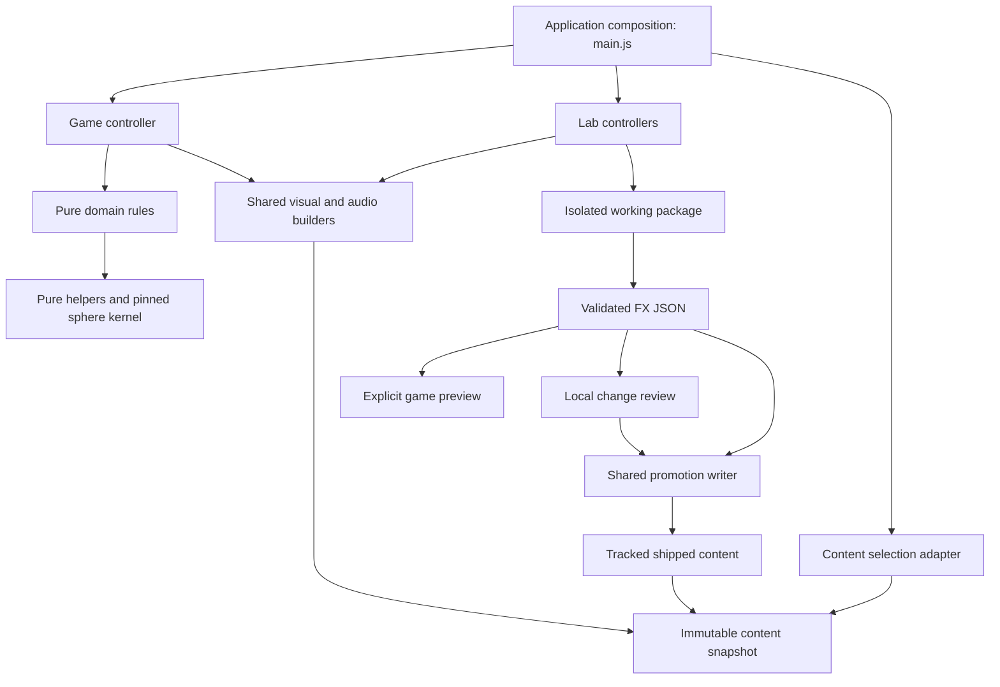

# Stalheart technical foundation

The owner's sequence is **architecture → visual/sound labs and clean exports → UX → playability**. Preserve the playable baseline while building the technical foundation. The first implementation establishes content ownership, pure rules and an executable authoring handoff; it does not claim that the inherited game controller has already been replaced.

## Ownership and dependencies



| Owner | Current files | Contract |
| --- | --- | --- |
| Core | `src/core/knobs.js`; pinned kernel in `src/` | No browser, persistence, rendering or game-controller dependencies |
| Domain | `src/domain/{economy,campaign,shield,berths,audiomix,audiogate,run-context}.js` | Rules over explicit values/state; no renderer, UI or storage; original top-level paths are compatibility re-exports |
| Content | `src/content/` | Defaults, portable schema, validation and one immutable snapshot per application lifetime; no Three.js or browser dependencies |
| Platform | `src/platform/` | Browser draft persistence and startup selection; errors are surfaced before the game starts |
| Presentation | Existing `impactfx.js`, `shotfx.js`, `beamdraw.js`, `audio.js`, model adapters | Shared builders consumed by game and labs; local geometry and explicit transforms; renderer/device ownership stays outside pure rules |
| Labs | `src/labs/`, existing `*-tab.js` lab controllers | Work on independent copies. Export validated data. Never import the game controller |
| Composition | `main.js`, inherited `td-tab.js` | Select content before consumers load. The TD closure still owns substantial simulation, rendering, input and tutorial integration |

`npm run architecture` enforces dependency rules and cycles in the migrated pure layers and rejects game/lab controller coupling. `npm run architecture -- --report` writes the dependency graph to `artifacts/architecture.json`. These are static import/browser-dependency checks, not a replacement for runtime tests. Legacy files outside the named layers remain an explicit migration boundary.

Compatibility facades preserve existing imports and tests while each moved implementation has one owner. Avoid copying an implementation into both paths. New pure code should import the owned module directly.

## Authoring contract

A schema-1 FX package has `application`, `base`, `id`, `weapons`, `audio`, `missiles` and `breach`. It includes every existing weapon profile and sound cue, so moving between the visual and sound labs retains the other half of the package. It contains no camera settings, saved progress, user volume preferences, external URLs or executable snippets.

- Visual fields: tracer appearance, muzzle/impact recipe, scale, color and bounded effect knobs.
- Audio fields: cue gain, voice cap, retrigger interval and pitch variation. Sample paths and bus assignments remain pinned runtime references.
- Weapon kinds, flight speeds and plasma behavior are locked to the schema's baseline because the game uses them as rules. New mechanics require a deliberate contract revision, not an artistic preset change.
- Unknown/missing fields, incompatible schema/base, non-finite or out-of-range values and invalid recipes are rejected before mutation.
- Selection clones and freezes the entire package. A draft cannot mutate the selected game's content. A second selection in the same lifetime is refused.
- A preset ID is a human label, not a content hash. Release build fingerprints identify shipped bytes; retain the exported JSON when comparing drafts with reused names.

The base is `stalheart-fx-7`. Version 6 imports retain weapon/audio/missile edits and gain the shared breach profile. Version 2 imports retain visual/audio edits and gain the missile lab defaults. Version 3 imports also retain their missile appearance/timing edits and gain the new 3–30 m engagement defaults. Version 4 imports preserve engagement bands and add per-family lock/tolerance defaults. Version 5 imports preserve the seven retained Sentries and missile edits, retire Howitzer and install fresh Needle visual/audio defaults. Version 1 remains incompatible. Schema changes require an explicit migration or a new base. Never silently coerce an incompatible artifact into a different-looking result.

## Actual workflow

1. Open the [Sentry / Impact lab](../labs.html#sentry) or [sound lab](../labs.html#audio). Each edits a copy of an immutable content snapshot.
2. Test and fine-tune. **Save working copy** saves canonical FX JSON in `artifacts/authoring/drafts/` on the local development server, where Codex can read it. Browser storage remains a fallback and preserves older drafts. **Load working copy** prefers the selected subject’s project draft, then the browser draft.
3. **Review changes** shows only the selected Sentry/cue’s changed fields against current defaults. It saves the working copy but does not promote it. Independent newer edits are preserved; conflicting edits require a fresh review against current defaults.
4. **Apply to …** commits the reviewed snapshot through the same promotion writer as the CLI, runs checks/build, and restores previous source if validation fails. Another tab cannot apply a stale review. Existing documents retain their immutable snapshot until reloaded.
5. **Undo last apply** reviews the inverse diff and restores the previous source only if the current revision still matches. Recovery records are retained in `artifacts/authoring/history/`.

**Copy changes for Codex** copies a short human-readable diff, not a new import format. **Backup / transfer** retains full-package JSON export/import. Static/release hosting has no authoring writer and retains browser drafts/exports. See [the authoring contract](AUTHORING.md) for boundaries, concurrency and recovery.

```sh
npm run presets -- export /tmp/current.stalheart-fx.json
npm run presets -- check /tmp/candidate.stalheart-fx.json
npm run presets -- promote /tmp/candidate.stalheart-fx.json
npm test
npm run check
npm run build
```

The same generated module is consumed in Node validation and the browser release. The combined Sentry / Impact lab uses the validated package workflow; the retired Impact source-copy panel is removed. The Sinkhole genre uses this schema and its own breach subject. Beam, material, legacy portal, cinematic and unit-specific exporters have not yet been converted to this schema. Do not describe them as covered until their actual runtime inputs are represented and tested.

## Shared Workshop controls

`src/labs/choice-browser.js` enhances native and lil-gui selects at Workshop composition, without importing the game or changing vendored controls. Lists of eight or more choices open a searchable modal with a bounded list, current selection, name/number filtering, arrow-key navigation, Enter selection and Escape cancellation. Short lists retain native controls. The original select owns values and emits the existing change event, so preset validation and model loading retain their existing paths.

The host observes added/removed controls and option changes, including lil-gui display updates after programmatic preset changes. It owns one dialog and releases its observers/listeners on document disposal. Styling is shared in `app.css`; the game does not load this module. Broader folder organization, common stage controls and export coverage remain separate work.

## Lifetime and resource contracts

The current application owns one game or lab document. Navigation releases that document. New controller APIs return `setActive` and optionally `dispose`; the sound lab has an explicit disposal path and uses the game's audio engine with injected cue definitions and persistence disabled. Lab volume auditions do not overwrite player volume preferences.

The first run-lifetime slice now lives in `src/domain/run-context.js`: read-only motion time and generation, explicit advancement/reset, stale-callback guards and disposal. `td-tab.js` advances and resets time at the same call sites as before. Generation begins before rebuilding, while the clock resets at its original later point; these are deliberately separate operations to preserve reconstruction behavior.

`src/platform/run-timers.js` owns the delayed hack ending, destruction preview and death-hold callbacks. Restart clears pending timers, and a generation guard also suppresses callbacks that were already queued. Completed timers release their handles. This is partial lifetime ownership: random streams, commands/events, other UI/probe timers, render loops and GPU disposal still belong to the legacy controller. The controller's disposal currently covers the extracted run resources and deactivates simulation; document teardown still releases the rest.

The next runtime extraction must centralize scope ownership for render loops, DOM listeners, timers, audio voices and disposable GPU resources. Existing effect factories already have useful local-space contracts, but their lifecycle conventions differ: impact effects tick by delta time while articulated units receive absolute time. Preserve this distinction in an explicit adapter before unifying interfaces.

## Ordered rebuild plan

1. **Architecture, current phase.** Keep the new boundaries enforced. Next extract a run context, command handling and domain events from `td-tab.js`; make input/render/audio adapters consume those boundaries. Move timer and random-stream ownership into the run context. Establish create/run/reset/dispose tests. Keep kernel, rosters and gameplay unchanged during extraction.
2. **Labs and authoring pipeline.** Extend the shared schema through tank beams, lighting/materials, portals and cinematics. Build common stage profiles for camera, scale, curvature, lighting, post-processing, seed and clock. Require a lab/game parity test and a complete import/export round trip for every promoted subsystem. Optimize Sentry assets within explicit footprint, socket, animation and device budgets.
3. **UX.** Use the stable shared systems to redesign information hierarchy, tutorial delivery, control feedback and Isao order visibility.
4. **Playability.** Tune threat budgets, gate economy and progression using repeatable scenarios and human playtests. The inherited late-wave growth remains known debt; this phase has not changed the difficulty curve.

Critical regressions are fixed as they arise, but they do not reorder the rebuild into a general balance or UX pass.

Sentry identity, numbering and radial order live in `src/content/sentries.js`. Version 2 retires classic weapon profiles and assigns each Sentry its own audio cue. Version 1 exports are rejected explicitly; recreate those edits against the current eight-Sentry package.


The Sentry range now owns the first missile presentation experiment, using a byte-pinned core sampler, a pure flat-range adapter and a bounded shared-resource DART pool. Sentry/Impact, Units and gameplay share `src/missiles.js` for launch snapshots, DART presentation and timing; gameplay adds a pure sphere adapter and applies missile damage on arrival. Acquisition, lock reset and firing eligibility now share `src/domain/missile-targeting.js`, with pure lock and Heptapod loop owners behind compatibility facades. Adapters provide eligible targets, actual aim error and ground metres; gameplay measures sphere arcs through a fixed 10-metres-per-cell contract. Version 5 promotes missile range/lock/tolerance values through the same reviewed package. Damage, cadence and magazine rules remain game-owned; lab drive/cadence controls remain preview-only. `missiles` fields survive every complete-package transfer. See [MISSILES.md](MISSILES.md) for ownership and gameplay adoption gates.

`src/labs/sentry-radial.js` owns the accessible eight-way modal, sourced from the shared catalog. The Sentry controller owns ray picking and drag discrimination, and sends a single selection through its existing family controller to rebuild the battery. The radial adds no game-controller dependency.

Sentry control labels now use `src/labs/control-help.js` for a shared hover/focus help card, with property-keyed explanations in `src/labs/sentry-help.js`. The card supports touch, Escape and disabled-control labels; reading a boolean label does not toggle its setting. Explanations distinguish range modes, units and missile-only behavior. The helper releases its listeners and description nodes with the lab.

## Shared Sentry / Impact range

`src/sentry-tab.js` owns the sole Sentry firing preview. `src/labs/sentry-effects.js` edits the selected weapon in that range’s complete working package; `src/labs/range-surfaces.js` owns fixed material fixtures and their outward normals. The controller uses the same `impactfx.js` factories as the game for launches and arrivals. Waves/Pop retain their existing enemy simulation; Wall/Armour/Hull are persistent fixtures, with distance, size and incidence controls. One time-scale control slows all preview motion together. Scene controls are not exported as weapon defaults.

`src/url.js` normalizes old `#impact` links before content and route consumers load, retaining the selected family and explicit draft. The old controller is a compatibility re-export, with no second flight implementation or renderer. The navigation has one Sentry / Impact entry. The tank Beam lab remains independent. This range is flat; the old Impact-only curvature preview is retired pending a shared sphere-stage contract, rather than claiming sphere parity from a separate viewer.

## Manual Sentry operation

Sniper imports the same roster, game stats, FX packages, shot/impact/audio builders and DART launcher as the other consumers. `src/domain/manual-weapon.js` adapts explicit content/stats to manual operation; `src/domain/ballistics.js` owns scope/environment trajectory math without a second weapon catalog. Scope input supplies aim to shared missile lock and eligibility rules. Stage gravity, wind, sway, optics and target exercises remain local simulation controls. `sniper-scale.js` applies isolated manual reach/speed scaling, `mortar-ground.js` solves raised-muzzle ground impacts through the existing integrator, and `labs/sniper-environment.js` owns the planet terrace, instanced canyon walls, mounted shared models and cover intersections. See [SNIPER.md](SNIPER.md) for the manual cassette contract, authoring boundaries and acceptance checks.


## Ground breach adapter

`src/game-breaches.js` owns bounded visual source lifetimes and floor-cut uniforms; `src/sinkhole.js` is the shared lab/game effect. The game controller owns the wall-cell mutation, protected structures, order refunds, navigation rebuild and wave queue. Frames map local effect coordinates onto the existing unit sphere without touching the grid kernel. Crack/decal render order precedes transparent actors; particle billboards inherit the host frame scale. The game uses one shared audio context and absolute particle clock. Base 7 carries appearance, total opening duration and clearance radius; fixture layouts and demonstration wave counts stay outside the preset.

Ground breaches have a one-way runtime lifecycle: pending opening, open, sealed/disposed. Only an actual opening batch cues quake audio/camera. `src/breach-rubble.js` retains sealed caps separately from active FX, sharing a single growing instance buffer across the run; reset clears it and teardown releases GPU resources. Camera shots do not freeze breach simulation or swallow the input used to skip them.

`src/content/tank.js` selects the default tank presentation for gameplay, spare hulls and Workshop/cinematic tank scenes. It is MÖRK; legacy castings remain explicit unit choices. Consumers preload the selected authored asset and use its muzzle/pivot contract rather than assuming MK-CX node names.

Astro station presentation lives in `src/labs/astro-diorama.js`; `src/domain/yard-route.js` finds visibility-graph routes around expanded prop footprints. Rigged instances share immutable geometry/materials and own their skeletons and mixers. The host supplies absolute stage time; hidden groups stop animation work. `astro-performance.js` owns a bounded 120-frame local sample window, complete renderer frame counters and baseline feedback. Per-group mesh budgets are estimates before shadow/post passes, and CPU submission time is explicitly not GPU timing.
